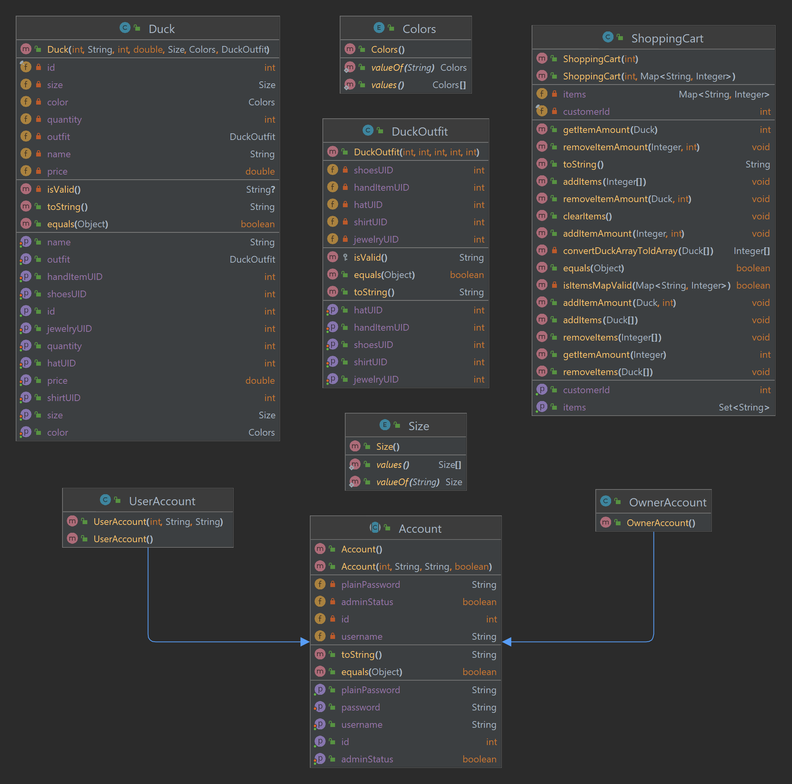

# PROJECT Design Documentation

## Team Information

* Team name: Quackers
* Team members
    * Mason Bausenwein
    * Travis Hill
    * Beining Zhou
    * Eric Choi
    * Andrew Le

## Executive Summary

This is a summary of the project.

### Purpose

Our goal is to create an onlne e-store that sells highly customizable
ducks. We aim to be able to fulfill both pre-made ducks and user customized
ducks.

### Glossary and Acronyms

| Term | Definition                |
|------|---------------------------|
| SPA  | Single Page               |
| MVP  | Minimum Viable Product    |
| UML  | Unified Modeling Language |
| OCP  | Open/Closed Principle     |

## Requirements

This section describes the features of the application.

### Definition of MVP

As of right now, our customers can select and search through a variety of
pre-made ducks from our store catalog and add or remove them from their
shopping carts
as they please. Users can register accounts to save their previous shopping
sessions
and login at a later date to resume them. From an owners perspective, they have
access
to the whole store catalog and can add/remove new products or even update
existing ones
at the click of a button.

### MVP Features

> _**[Sprint 4]** Provide a list of top-level Epics and/or Stories of the MVP._

### Enhancements

> _**[Sprint 4]** Describe what enhancements you have implemented for the
project._

## Application Domain

This section describes the application domain.

> _**[Sprint 2 & 4]** Provide a high-level overview of the domain for this
application. You
> can discuss the more important domain entities and their relationship
> to each other._

## Architecture and Design

This section describes the application architecture.

### Summary

The following Tiers/Layers model shows a high-level view of the webapp's
architecture.

The e-store web application, is built using the Model–View–ViewModel (MVVM)
architecture pattern.

The Model stores the application data objects including any functionality to
provide persistance.

The View is the client-side SPA built with Angular utilizing HTML, CSS and
TypeScript. The ViewModel provides RESTful APIs to the client (View) as well as
any logic required to manipulate the data objects from the Model.

Both the ViewModel and Model are built using Java and Spring Framework. Details
of the components within these tiers are supplied below.

### Overview of User Interface

This section describes the web interface flow; this is how the user views and
interacts
with the e-store application.

> _Provide a summary of the application's user interface. Describe, from
> the user's perspective, the flow of the pages in the web application._

### View Tier

> _**[Sprint 4]** Provide a summary of the View Tier UI of your architecture.
> Describe the types of components in the tier and describe their
> responsibilities. This should be a narrative description, i.e. it has
> a flow or "story line" that the reader can follow._

> _**[Sprint 4]** You must provide at least **2 sequence diagrams** as is
relevant to a particular aspects
> of the design that you are describing. For example, in e-store you might
create a
> sequence diagram of a customer searching for an item and adding to their
cart.
> As these can span multiple tiers, be sure to include an relevant HTTP
requests from the client-side to the server-side
> to help illustrate the end-to-end flow._

> _**[Sprint 4]** To adequately show your system, you will need to present
the **class diagrams** where relevant in your design. Some additional tips:_
>* _Class diagrams only apply to the **ViewModel** and **Model** Tier_
>* _A single class diagram of the entire system will not be effective. You may
   start with one, but will be need to break it down into smaller sections to
   account for requirements of each of the Tier static models below._
>* _Correct labeling of relationships with proper notation for the relationship
   type, multiplicities, and navigation information will be important._
>* _Include other details such as attributes and method signatures that you
   think are needed to support the level of detail in your discussion._

### ViewModel Tier

> _**[Sprint 4]** Provide a summary of this tier of your architecture. This
> section will follow the same instructions that are given for the View
> Tier above._

> _At appropriate places as part of this narrative provide **one** or more
updated and **properly labeled**
> static models (UML class diagrams) with some details such as critical
attributes and methods._
>

### Model Tier

We have three main classes in our Model Tier and various smaller classes that
are utilized in these main classes. These classes are Duck, ShoppingCart, and
Account. Our entire website will revolve around these base classes. A user will
create an Account to add a Duck to their Shopping Cart
to be eventually purchased. The Duck class utilizes three smaller classes
defined in the model tier: Colors, Size, and DuckOutfit. Both Colors and Size
are enums meant to describe the constant color and size of the duck. DuckOutfit
will describe the accessories a duck can have at the time of purchase. All
these classes will affect the total price of the duck for the shopper. Account
is an abstract class that has two subclasses, UserAccount and OwnerAccount
which both inherits Account's base properties. A UserAccount is what a regular
shopper will have when they register to the site. A OwnerAccount is created on
startup and can not be regsitered or created directly. The UserAccount's ID is
linked to their own Shopping Cart ID, an OwnerAccount's ID is not and they do
not have access to a shopping cart.

## OO Design Principles

### Open/Closed Principle (_**NEEDS DIAGRAM**_)

The Open/Closed Principle is that software entities should be open for
extension but closed for modification. Our Domain Analysis illustrates this by
creating multiple states/ entities that can be used in other entities through
extension but cannot be changed/ modified by them. An example of this is that
the user account can include a shopping cart, but the shopping cart alone
cannot modify the user account by itself. A way that we could possibly follow
this principle better could be to either break down our design into more
specific details by creating more entities

### Pure Fabrication (_**NEEDS DIAGRAM**_)

This principle is applied in our design with our user account. This is merely a
way to store a username, password, and payment information in an easy manner.
Our authentication system is going to be handling all the creation,
establishing, and verifying of the credentials within it. If the user account
is being created, the authentication system will store it in its
records. If an account already exists and somebody is trying to log in, then
our authentication system will take the data from the user account in its
records and parse it respectively with its own methods. If a user wants to
delete their account, the authentication system removes it from its records. A
user account has no functionality other than storing the data for an account.
Our shopping cart would most likely serve to benefit from pure fabrication. We
need something to handle the product methods. Right now, we would have to add
multiple methods to our shopping cart class to gather all the information
needed to properly calculate the total of all the items in our cart and display
them. These methods have no logic related to a shopping cart so including them
in this class would prove to be troublesome. So instead, we should
create a checkout class that handles all these calculations making the shopping
cart class more cohesive in the process. Not to mention, this code can also be
applied in other situations than the checkout, such as showing the total value
of all the items in the shopping cart when a user is not on the checkout
screen.

### Single Responsibility (_**NEEDS DIAGRAM**_)

As of now, our design makes use of the single responsibility object-oriented
design principle by separating our entity objects from our data accessor
objects. We use the entities to allow for runtime data persistence, and we use
our data accessors to read data from a file, so it can be serialized to an
entity. Additionally, our controller classes will only serve one group of
endpoints. For example, our inventory controller will only serve
endpoints relating to inventory management. Furthermore, if a controller class
started to become very lengthy, we could divide the controller class into
multiple classes that would encompass all the original endpoints. Finally, our
inventory class will serve as an information expert on products, allowing
products to be added, removed, edited, and searched based on specific
parameters. Separating our responsibilities like this makes our code more
readable and easier to work on.  

To incorporate the single responsibility object-oriented design principle even
more into our design, I suggest that for our duck class that the property
attributes of the duck, such as color, size, etc., are stored in a separate
DuckProperties class. Then, the duck entity class could serve as an information
expert for the duck’s properties. Additionally, a customer’s profile data could
be saved in a profile entity object that is linked to the customer entity
object. However, certain information, such as the customer’s name, would remain
stored in the customer entity object.

### Information Expert (_**REFERENCES MODEL UML**_)

The responsibility should be assigned to the object that has the information
that allows the task to be completed.

Applications: 
The model tier UML diagrams above adhere to the information expert principle.
For example, in the shopping cart class, the shopping cart is given the
responsibility of checking out and removing the item. This adheres to the
principle because since the object holds the item, we can assign the
responsibilities of adding the item, removing the item, and editing the number
of the item to the Shopping cart class. This keeps the class UML diagram simple
and easy to understand without creating complications. Another class that
supports the information expert principle is the Accounts class. The Accounts
class is responsible for updating the profile information and this is important
as the Accounts class holds a profile object. Since the account class holds a
profile object, It is appropriate to give the Accounts class the responsibility
of updating the profile information. Thus, making the UML diagram adhere to
the information expert principle.

> _**[Sprint 3 & 4]** OO Design Principles should span across **all tiers.**_

## Static Code Analysis/Future Design Improvements

> _**[Sprint 4]** With the results from the Static Code Analysis exercise,
> **Identify 3-4** areas within your code that have been flagged by the Static
Code
> Analysis Tool (SonarQube) and provide your analysis and recommendations.  
> Include any relevant screenshot(s) with each area._

> _**[Sprint 4]** Discuss **future** refactoring and other design improvements
your team would explore if the team had additional time._

## Testing

### Acceptance Testing

All of the acceptance criteria tests for the user stories in Sprint 1 have
passed. As of writing this in Sprint 2, the Epic for the Base Authentication
System has all of its user stories completed with their acceptance criteria
being met. All the user stories associated with the Shopping Cart Epic except
for one have also met the acceptance criteria. The Shopping Cart Page is the
only user story in the epic that does not meet acceptance criteria. This is
because other front-end development had to occur to have the proper services
available and our team is just now starting to develop the page. The Inventory
Management Page Epic is currently undergoing testing and appears to have all
its user stories meet the acceptance criteria. It is awaiting being merged into
main before the Trello cards can be moved to Sprint 2 Done. The Customer View
Page, which is not associated with any Epic, also does not meet any of the
acceptance criteria yet. Just like with the Shopping Cart Page, other
fundamental aspects of the back-end and front-end had to be developed so no
progress could be made on it. However, now that these needs are granted
development should be started now and the tests should be run and the
acceptance criteria met by the time this sprint is done. There are no major
concerns at the moment and we believe that all acceptance criteria for the user
stories in Sprint 2 will be met and the user stories will be marked as
completed before the sprint ends. Everything is going according to plan and we
should be prepared for the demo.

### Unit Testing and Code Coverage

