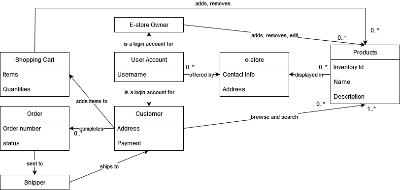
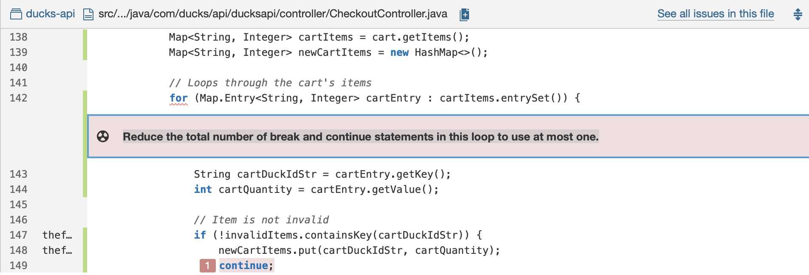
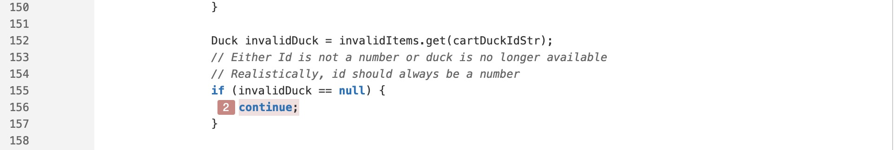
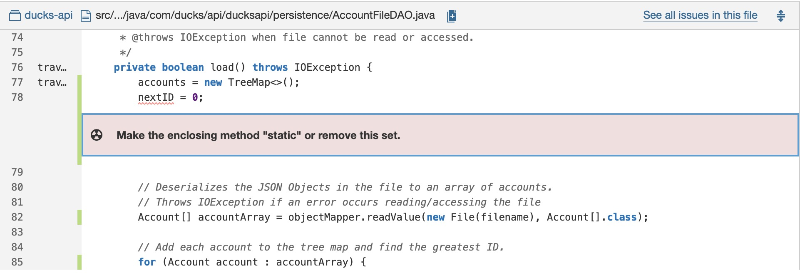
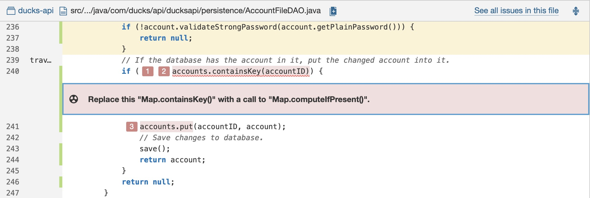

# PROJECT Design Documentation

## Team Information

* Team name: Quackers
* Team members
    * Mason Bausenwein
    * Travis Hill
    * Beining Zhou
    * Eric Choi
    * Andrew Le

## Executive Summary

This is a summary of the project.

### Purpose

Our goal is to create an onlne e-store that sells highly customizable
ducks. We aim to be able to fulfill both pre-made ducks and user customized
ducks.

### Glossary and Acronyms

| Term | Definition                |
|------|---------------------------|
| SPA  | Single Page               |
| MVP  | Minimum Viable Product    |
| UML  | Unified Modeling Language |
| OCP  | Open/Closed Principle     |

## Requirements

This section describes the features of the application.

### Definition of MVP

Customers, granted they are logged into an account, can view and 
search through a variety of pre-made ducks from the store catalog.
If a customer does not have an account they can register one to use 
the store if the account name does not already exist. This account 
will also save their previous shopping sessions so they can return
at a later date to resume them. Once they find a duck they would like 
to purchase, they can select it and add it to their cart. They may view 
their shopping cart contents at any time during the shopping process by 
clicking on the shopping cart button. When viewing the contents of the 
shopping cart and the customer decides they no longer want to purchase a 
duck, they may remove it from their shopping cart individually or clear 
the entire cart all at once. The total price is also displayed on the page. 
Once a customer has decided they are done shopping and would like to checkout 
they navigate to the shopping cart page and select the checkout button. Here
they will enter their contact, shipping, and payment information. When the 
checkout is complete they will be given a receipt that shows the contents of 
the order and the total price paid. From an owners perspective, they have access
to the whole store catalog and can add/remove new products or even update existing 
ones at the click of a button. They can also search for specific ducks in the inventory
for easier access. Admin accounts do not have access to a shopping cart and cannot shop 
on the store.

### MVP Features
### 1. Minimal Authentication for Customer/Onwer Login & Logout
* Login Page (5)
    * Story : As a Customer/Owner, I want to be able to view the login page first and log in before being sent to my shopping cart and the catalog OR accessing admin tools depending on privileges.
    * Details : Every User must sign in before using the site. The site will then authenticate if the user is a customer or an admin.


### 2. Customer Funtionality
* Catalog Page (18) (EPIC)
    * Story : As a BUYER I want to BE ABLE TO VIEW THE PRODUCT PAGE so that I CAN VIEW PRODUCTS AND ADD THEM TO MY CART.
    * Details : The site will provide the customer with a user interface that will allow the customer to purchase ducks.
* Catalog Page - Product View (3)
    * Story : As an BUYER I want to SEE PRODUCTS ON THE CATALOG PAGE so that I ADD THEM MY SHOPPING CART.
    * Details : The site will provide the customer with a catalog page that will allow the customer to see the available ducks on the website.
* Catalog Page - Search Products (5)
    * Story : As a BUYER I want to BE ABLE TO SEARCH THE PRODUCT PAGE so that I CAN VIEW PRODUCTS WITH SPECIFIC NAME.
    * Details : The site will provide the customer with a search bar that will allow the customer to find ducks with a specific name available on the website.
* Catalog Page - Add to Cart (5)
    * Story : As a Customer/Owner, I want to be able to view the login page first and log in before being sent to my shopping cart and the catalog OR accessing admin tools depending on privileges.
    * Details : The site will provide the customer with the ability to add a duck to a shopping cart, allowing them to purchase it.
* Shopping Cart Page (6)
    * Story : As a BUYER I want to BE ABLE TO VIEW MY SHOPPING CART so that ADD/REMOVE ITEMS FROM MY CART AND BUY THEM.
    * Details : The site will provide the customer with a shopping cart page that will allow the customer to view the ducks in the cart before checkout and make changes to the cart, such as removing ducks if needed.
* Checkout Page - Checkout (3)
    * Story : As a CUSTOMER I want to SEE A RECEIPT OF THE ITEMS I PURCHASED so that I CAN MAKE SURE I BOUGHT EVERYTHING I WANT
    * Details : The site will provide the customer with a receipt that will allow the customer to purchase the ducks within the shopping cart and review a summary of what the customer purchased.


### 3. Inventory Management   
* Inventory Management (15) (EPIC)
   * Story : As an OWNER I want to HAVE AN INVENTORY MANAGEMENT PAGE so that I CAN ADD/REMOVE/EDIT PRODUCTS.
    * Details : The site will provide the owner with an inventory managment page that will allow the owner to add, remove, and edit products within the inventory, and the changes will reflect what the customer will see in the catalog.
* Inventory Management - Product View (5)
    * Story : As an OWNER I want to SEE PRODUCTS ON THE INVENTORY MANAGEMENT PAGE so that I CAN SELECT THEM TO MODIFY.
    * Details : The site will provide the Owner with an inventory mangagement page that will allow the owner to see the ducks listed in the inventory.
* Inventory Management - Create Product Page (5)
    * Story : As an owner I want to create be able to create a product so that my customers are able to buy it.
    * Details : The site will provide the Owner with the ability to create a new duck that will be added to the inventory, and these changes will be reflected on the catalog page.
* Inventory Management - Modify Product Page (5)
    * Story : As an OWNER I want to be able to modify products so that I can change the price, quantity available, name, etc of my items.
    * Details : The site will provide the Owner with the ability to modify and delete a duck from the inventory, and these changes will be reflected on the catalog page.

### 4. Data Persistence
* Session Management (3)
    * Story : As a USER I want to HAVE MY DATA PERSIST BETWEEN PAGES so that I DONT HAVE TO LOGIN EVERY TIME
    * Details : The website will remember what user is logged in when switching between pages. This will allow the user to freely enter other pages of the website without having to login every time.
* Create Shopping Card Models - Shopping Cart (5)
    * Story : As a DEVELOPER, I want to be able to access a Customer’s shopping cart so that the SYSTEM is able to save it, modify it, and display the correct information.
    * Details : The website will provide a shopping cart that remembers its previous state. So if a customer adds an item to their cart and logs out, they should see the same items in their shopping cart when they log back in.

### Enhancements

There are three main enhancements for the project: Profile Pages, Strong Passwords, 
and Custom Duck Creation. Strong passwords is the simplest feature of the three.
It adds password management and increased security for user accounts on the store. 
During account creation, a user is forced to enter a password during account creation,
it cannot be blank. Ontop of that it must meet a minimum of 8 characters and have at
least one upper and lower case character, one number, and one special character. If
a password does not meet these requirements, the account will not be created and feedback
will be displayed to the user telling them the requirements. A user can also reset their
passwords with this enhancement. They can enter a new password and it will be changed,
as long as the new password is also considered a strong password. Before, this was not 
possible and no password, let alone a strong one, was required upon account creation. 
Profile Page is a relatively straight forward enhancement as well. During checkout, a 
user must enter all their contact, shipping, and payment information. Before they had
to do this by hand every single time which was a time-consuming process. However, if they 
use the profile page enhancement they can fill out all this information once and it 
will be saved to their account. Then upon checkout, all this information will be filled 
out automatically by the store based on the profile page associated with the account.
This profile information can be updated and saved at any time and is accessible by 
clicking the "Account" button on the store page. The third and final enhancement 
is a Custom Duck Creator. Customers can access this by selecting the "Make Your Own Duck" 
button on the store page. Once selected, a customer can create their own custom duck by 
using the GUI presented to them rather than selecting a pre-made one that is in the catalog. 
In this GUI, they can select the name, quantity, size, color, and accessories of the duck 
from a drop down menu of existing options. A live preview is shown on the side where it shows
each customization that is being made to the duck is made as well as a live price calculation
so the customer knows what they are buying and at what cost. Once they are done creating the 
custom duck, it is added to the customers shopping cart and is capable of being purchased.


## Application Domain

This section describes the application domain.



As our goal is to create an e-store, our domain model contains entities, such as 
duck (our product), customer, shopping cart, and more. One of our most essential
entities is Duck. Duck is connected to most of the other entities to facilitate
necessary functionality, such as displaying our items on our catalog page.
Additionally, our profile page allows our customers to view and modify their payment
and shipping information. This information can then be auto-filled into the checkout
form, giving them a more enjoyable checkout experience. Finally, our Custom Duck
entity lets customers create their own ducks if they do not like any of our premade ones.

## Architecture and Design

This section describes the application architecture.

### Summary

The following Tiers/Layers model shows a high-level view of the webapp's
architecture.


The e-store web application, is built using the Model–View–ViewModel (MVVM)
architecture pattern.

The Model stores the application data objects including any functionality to
provide persistance.

The View is the client-side SPA built with Angular utilizing HTML, CSS and
TypeScript. The ViewModel provides RESTful APIs to the client (View) as well as
any logic required to manipulate the data objects from the Model.

Both the ViewModel and Model are built using Java and Spring Framework. Details
of the components within these tiers are supplied below.

### Overview of User Interface

This section describes the web interface flow; this is how the user views and
interacts
with the e-store application.

Upon opening our website, the user will be greeted with a login page where they 
can either log in or register. Users who log in with an admin account will
be directed to the inventory management page. From this page, they will be able to
create, modify, and delete products. If a non-admin attempts to access the inventory
management page, they will be redirected to the login page. If the user logs in as a
buyer, they will be redirected to a catalog page where they can view all of the
available items. Furthermore, they can use a search box to filter through
the available items. They are also able to add these items to their cart. Once they have
added the items they want, they can proceed to the shopping cart to modify
the quantity of each item and checkout. After checking out, they are directed to a page
where they are given a receipt.

### View Tier
Our view tier has many components and services. The first one our users come into contact 
with is our LoginComponent. This component is responsible for displaying the login page. 
Next, they indirectly use our AccountService to verify their credentials when they click 
the login button. From here, there are two options:

1. If they are a customer, they will be redirected to our catalog page that is rendered using
our CatalogComponent. Our CatalogComponent also calls our CartService to get their shopping service
and our ProductService to retrieve all of our items. From here, a user is able to add items to their
cart, create custom ducks (via our CustomizeComponent), search for ducks (via our DuckSearchCompponent), 
access their shopping cart (via our ShoppingCartComponent), and view their profile page 
(via our ProfileComponent).<br>
    * If a user wants to add an item to their cart, the following sequence of events will happen:
    
    * If a user wants to create a custom duck, the following sequence of events will happen:
    
    * If a user wants to search for a duck, they simply use the search box at the top of catalog page. Upon typing in the box, our DuckSearchComponent will automatically find all ducks that contain the search query (case sensitive).
    * If a user opts to open their shopping cart, the CartService and CustomDuckService will both be used to retrieve all of the items in their cart. While in the cart, they will be able to clear their cart, remove items, and checkout. Our checkout menu is rendered using out CheckoutComponent. Upon submitting the checkout form the CartService and CustomDuckService are used to validate and clear their cart before our ReceiptComponent opens to show the user their receipt.
    * If a user opts to open their profile page, they will be able to modify their payment and shipping information by clicking the respective buttons. These buttons will open menus that are rendered by our PaymentModifyComponent and ShippingModifyComponent. Once they are in the menu, they are able to update their information and click submit, which will then call our AccountService to update their account. 
2. If they are an owner, they will be redirected to our inventory management page that is rendered
using our InventoryManagementComponent. Our InventoryManagementComponent calls our Product service
to retrieve all of our items and their respective details. Like the catalog, owners can also search
for products to make it easier to find the product they want to modify. This functionality is once
again provided by the DuckSearchComponent. Owners are also able to remove items from the catalog by
clicking the remove button (via our ProductService). Finally, owners can create and modify ducks by
using our ProductCreateModifyComponent and indirectly using our ProductService.
    * If an owner wants to create or modify a product, they simply either click the modify button 
    underneath an item's name or they click the create a product button at the top of the 
    inventory managment page. Next, if the owner is modifying an item, the ProductService will be 
    called to fill in the info of the current duck. If they are creating an item, the menu will
    simply open with no default values. Once they fill in the form completely they can hit the
    submit button, which will again call the ProductService, but this time, to update the item or to
    create a new one.

### ViewModel Tier

The View Tier UI is responsible for presenting the user interface to the end user. It consists 
of various components that handle different aspects of the UI such as the User Interface Framework, 
View Manager, View Controller, and the data binding component. The User Interface Framework, which 
provides a foundation for building the UI. This includes things like layout managers, event handlers, 
and other UI controls.The View Manager, which is responsible for managing the views that are displayed 
to the user. This includes things like creating new views, updating existing views, and managing 
the overall layout of the UI. The third component is the view controller, which is responsible for 
managing the interactions between the user and the UI. This includes things like handling user input,
responding to user actions, and managing the state of the UI. Finally, there is the data binding 
component, which is responsible for binding data from the backend to the UI. This includes things 
like retrieving data from a database, formatting the data for display, and updating the UI as the
data changes. Overall, our View Tier UI provides a responsive and intuitive user interface for 
the website. By using a combination of these components, we created a UI that is both easy 
to use and easy to maintain.


### Model Tier

We have three main classes in our Model Tier and various smaller classes that
are utilized in these main classes. These classes are Duck, ShoppingCart, and
Account. Our entire website will revolve around these base classes. A user will
create an Account to add a Duck to their Shopping Cart
to be eventually purchased. The Duck class utilizes three smaller classes
defined in the model tier: Colors, Size, and DuckOutfit. Both Colors and Size
are enums meant to describe the constant color and size of the duck. DuckOutfit
will describe the accessories a duck can have at the time of purchase. All
these classes will affect the total price of the duck for the shopper. Account
is an abstract class that has two subclasses, UserAccount and OwnerAccount
which both inherits Account's base properties. A UserAccount is what a regular
shopper will have when they register to the site. A OwnerAccount is created on
startup and can not be regsitered or created directly. The UserAccount's ID is
linked to their own Shopping Cart ID, an OwnerAccount's ID is not and they do
not have access to a shopping cart.


## OO Design Principles

### Open/Closed Principle

The Open/Closed Principle is a design principle stating that software entities 
should be open for extension but closed for modification, in order to allow for 
flexibility and maintainability in the software design. 

Applications:<br>
The Open/Closed Principle is applied in our design by creating multiple states/
entities that are open for extension but closed for modification by other 
entities. To further adhere to this principle, we broke down our design into more
specific components and creating additional entities that share functionality, 
allowing for easier extension without the need for modification.
An example of this principle in action is our Account class, which is an abstract
class that provides essential properties and basic functionality to classes like 
UserAccount and OwnerAccount, which implement it. UserAccount and OwnerAccount 
classes meet the Open/Closed Principle by extending the abstract Account class, 
which is closed for modification. Both UserAccount and OwnerAccount classes 
inherit the properties and basic functionality provided by the Account class 
without modifying it. This allows for easy extension of the Account class by 
adding new classes that also inherit from it, without changing the existing 
implementation.


### Pure Fabrication

Pure Fabrication is a design principle stating that a class or module should be
created solely for the purpose of fulfilling a certain functionality or 
responsibility, without being tied to a specific entity or behavior in the system.

Applications:<br>
This principle is applied in our design with our user account, as seen above in 
the Model Tier UML diagram. This is merely a way to store a username, password, 
and payment information in an easy manner. Our authentication system is going to
be handling all the creation, establishing, and verifying of the credentials 
within it. If the user account is being created, the authentication system will 
store it in its records. If an account already exists and somebody is trying to 
log in, then our authentication system will take the data from the user account 
in its records and parse it respectively with its own methods. If a user wants 
to delete their account, the authentication system removes it from its records. 
A user account has no functionality other than storing the data for an account.


Our shopping cart would most likely serve to benefit from pure fabrication. We
need something to handle the product methods. Right now, we would have to add
multiple methods to our shopping cart class to gather all the information
needed to properly calculate the total of all the items in our cart and display
them. These methods have no logic related to a shopping cart so including them
in this class would prove to be troublesome. So instead, we should
create a checkout class that handles all these calculations making the shopping
cart class more cohesive in the process. Not to mention, this code can also be
applied in other situations than the checkout, such as showing the total value
of all the items in the shopping cart when a user is not on the checkout
screen.

### Single Responsibility

Single Responsibility is a design principle stating that a class or module 
should have only one reason to change.

Applications:<br>
As of now, our design makes use of the single responsibility object-oriented
design principle by separating our entity objects from our data accessor
objects. We use the entities to allow for runtime data persistence, and we use
our data accessors to read data from a file, so it can be serialized to an
entity. Additionally, our controller classes will only serve one group of
endpoints. For example, our inventory controller will only serve
endpoints relating to inventory management. Furthermore, if a controller class
started to become very lengthy, we could divide the controller class into
multiple classes that would encompass all the original endpoints. Finally, our
inventory class will serve as an information expert on products, allowing
products to be added, removed, edited, and searched based on specific
parameters. Separating our responsibilities like this makes our code more
readable and easier to work on.

To incorporate the single responsibility object-oriented design principle even
more into our design, I suggest that for our duck class that the property
attributes of the duck, such as color, size, etc., are stored in a separate
DuckProperties class. Then, the duck entity class could serve as an information
expert for the duck’s properties. Additionally, a customer’s profile data could
be saved in a profile entity object that is linked to the customer entity
object. However, certain information, such as the customer’s name, would remain
stored in the customer entity object.


### Information Expert

Information Expert is a design principle where responsibility is assigned 
to an object that has the information needed to complete a task.

Applications:<br>
The Model Tier UML diagram above adheres to the information expert principle. For
example, in the shopping cart class, the shopping cart is given the 
responsibility of checking out and removing items from the cart. 
Because the shopping cart object holds the item array, we can assign it the
responsibility of adding items, removing items, and editing the quantity of
each item in the cart. This keeps the class UML diagram simple and easy to 
understand without creating complications. For example, if a user 
wants to remove an item from their cart, the Shopping cart class can check whether
the item exists in the cart by searching through its list of items. If the
item is found, the Shopping cart class can remove it from the cart, as it holds 
the necessary information about the item.


Another class that supports the information expert principle is the Accounts class.
The Accounts class is responsible for updating the profile information and this is 
important as the Accounts class holds a profile object. Since the account class 
holds a profile object, it is appropriate to give the Accounts class the 
responsibility of updating the profile information.


## Static Code Analysis/Future Design Improvements
### Area 1: More than one break and continue statements in the loop.


Restricting the number of break and continue statements in a loop is done in the 
interest of good structured programming because it can help make the code more 
readable, understandable, and maintainable. 
This can be solved by combining the conditions that are used to skip processing 
of the cart items into a single if statement:
```java
if (!invalidItems.containsKey(cartDuckIdStr) || invalidItems.get(cartDuckIdStr) == null) {
    continue;
}
```
### Area 2: Reference non-static variables or methods from within a static method or block.

Correctly updating a static field from a non-static method is tricky to get right and
could easily lead to bugs if there are multiple class instances and/or multiple 
threads in play. Ideally, static fields are only updated from synchronized static 
methods. 
This can be solved by making the load() method static:

```java
private static boolean load() throws IOException {
    nextID = 0;
    ...
}
```

### Area 3: Call java.util.Map.containsKey() before proceeding with adding or changing the value in the map. 

It’s a common pattern to test the result of a java.util.Map.get() against null or 
calling java.util.Map.containsKey() before proceeding with adding or changing the
value in the map. However the java.util.Map API offers a significantly better 
alternative in the form of the computeIfPresent() and computeIfAbsent() methods. 
Using these instead leads to cleaner and more readable code.
This can be solved by replacing this "Map.containsKey()" with a call to "Map.computeIfPresent()":

```java
accounts.computeIfPresent(accountID, (key, value) -> {
    save();
    return account;
});
```
### Future Refactoring: Implement an email verification feature for the password reset process
In the current version, resetting a password only requires entering a username and
a new password, then clicking the reset password button without any verification. 
The risk is that anyone can tamper password with a specific username, which could 
lead to the disclosure of address and payment information.
<br>To prevent this, an email verification step can be added to the password reset 
process. When the user initiates a password reset request, the system can send an
email to the registered email address with a verification code or link. The user 
must then enter the code or click the link to verify their email address before 
being allowed to proceed with resetting their password.
<br>To implement this feature, the Account model would need to be updated to include 
email properties, such as the user's email address and a flag indicating whether 
the email address has been verified. The system would also need to include logic 
for generating and sending the verification email, and for verifying the user's
email address when they enter the verification code or click the verification link.


## Testing

### Acceptance Testing

Out of our 64 acceptance criteria tests, all passed except for 7 of them. However, we
expected these 7 to fail because the story card was for a feature that was removed due to
it being no longer necessary. Furthermore, some of our acceptance criteria needed slight 
adjustments to account for pages being turned into angular modals, meaning they no longer 
had the routes the criteria referred to. Other than the tests mentioned above and these slight
changes, everything went well. In this sprint, we also tried to make our acceptance criteria
tests more detailed to cover more paths.

### Unit Testing and Code Coverage

When creating unit tests, we focused on making sure that the most critical features had
nearly all, if not all, branches covered. We deemed all MVP features critical and
aimed for nearly 100% code coverage for them. When it came to non MVP features, such as
our enhancements, we aimed for 90%+ code coverage. We chose these values because we felt
they would nearly guarantee our backend to be bug-free. Additionally, we felt that
because of how important the MVP was, we needed to ensure that there would be as few
bugs as possible, so we aimed for nearly 100% code coverage for those features.

We reached our goals with an overall 96% code coverage. All of our MVP features have
code coverages of upwards of 95%. Our Account class had the lowest coverage of 87%.
This is because we did not unit-test the hashCode and confirmPassword functions.
In fact, a lot of our missing coverage comes from not testing our hashCode functions.


